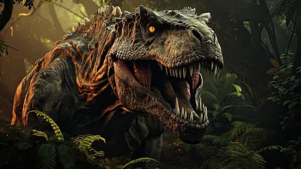

<!-- PROJECT LOGO -->   
 

# Rex

3D version of [T-Rex Chrome Dinosaur Game](https://chrome-dino.com/).

### Built With
* [Unity](https://unity.com/)
* [Blender](https://www.blender.org/)
* [C#](https://learn.microsoft.com/en-us/dotnet/csharp/tour-of-csharp/)

## Preview

## Getting Started

To get the game running follow these simple steps.

### Installation
* Get the Zip file from [drive](https://drive.google.com/file/d/1Ij6Er3k1Vtw6iwRnAQyrz-Vo-2rTnmFa/view?usp=sharing) and extract it.

        run the project(1) file
        enjoy

Disclaimer: Only tested for Windows.
## Contact

Email ID - lakshay21059@iiitd.ac.in
## Acknowledgements

Lakshay Bansal lakshay21059@iiitd.ac.in

